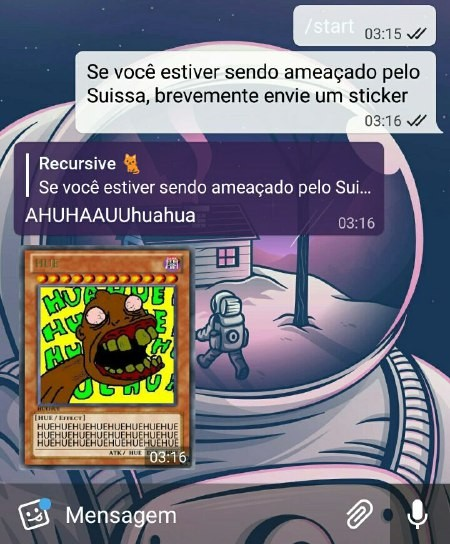

# Le lerax (@ryukinix on GitHub)

> This Telegram bot comes with ABSOLUTELY NO WARRANTY.

<p align="center">
  <a href="">
    
    
  </a>
</p>

### Install

1. First define your token at the first line of `token.txt` file.


2. Create a virtualenv at `env` dir, install deps and execute repl or bot:

``` shell
virtualenv env
source env/bin/activate
pip install -r requirements.txt
./bot # use ./repl to talk at @uapda channel
```

### FAQ
- __How to execute this code?__
  - Telepot: `> pip install telepot`
  - Create your own Telegram bot: https://core.telegram.org/bots#botfather
  - Set bot's `privacy mode` to `disabled`: https://core.telegram.org/bots#privacy-mode
  - Get a Telegram Bot API Token: https://core.telegram.org/bots/api#authorizing-your-bot
  - Add your bot to the desired group(s)
  - Lastly: `> python bot.py YOUR_TELEGRAM_BOT_API_TOKEN`
